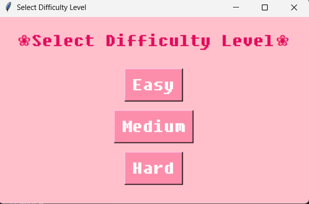

# 🌸 Connect 4 with AI 

A fun and visually adorable Connect 4 game where you play against a smart AI opponent! This version features flower-shaped pieces, soft colors, and adjustable difficulty levels to suit casual players and challengers alike. 🌼

---

## 🎮 Features

* 🌼 Flower-themed game board
* 🤖 Play against AI with 3 difficulty levels: Easy, Medium, Hard
* 🎨 Cute and colorful interface (pink-themed)
* 🧠 Minimax-based AI for smart gameplay
* 💡 Turn-based interaction with visual feedback
* 📦 No external libraries needed (just Python and `tkinter`)

---

## 🛠️ Installation

### 1. Clone the Repository

```bash
git clone https://github.com/jannah-ayman/Connect4
cd Connect4
```

### 2. Run the Game

Make sure you’re using Python 3:

```bash
python connect4.py
```

---

## 💡 How to Play

1. When you launch the game, a **difficulty selection** window appears.
   Choose **Easy**, **Medium**, or **Hard**.
2. Click the **down arrow buttons** at the top to drop your flower into the column.
3. Try to connect **4 flowers in a row**—horizontally, vertically, or diagonally—before the AI does!
4. The game ends with a message depending on who wins or if it's a draw.

---

## 📷 Screenshots

> 
> 

---

## 🧠 AI Logic

* Uses the **Minimax algorithm** with variable depth (based on difficulty).
* Evaluates board positions based on potential connections.
* Responds instantly after your move.

---

## 👩‍💻 Team Members

* Jannah Ayman Abdelraouf 
* Rawan Sotohy Mohamed 
* Nancy Saad Mohamed
* Shrouk Mohsen Hamza

---

## 🎨 UI Theme

* **Flower tokens** instead of traditional circles
* **Pink background** with soft tones
* Fonts and colors selected for a cozy, friendly vibe

---
